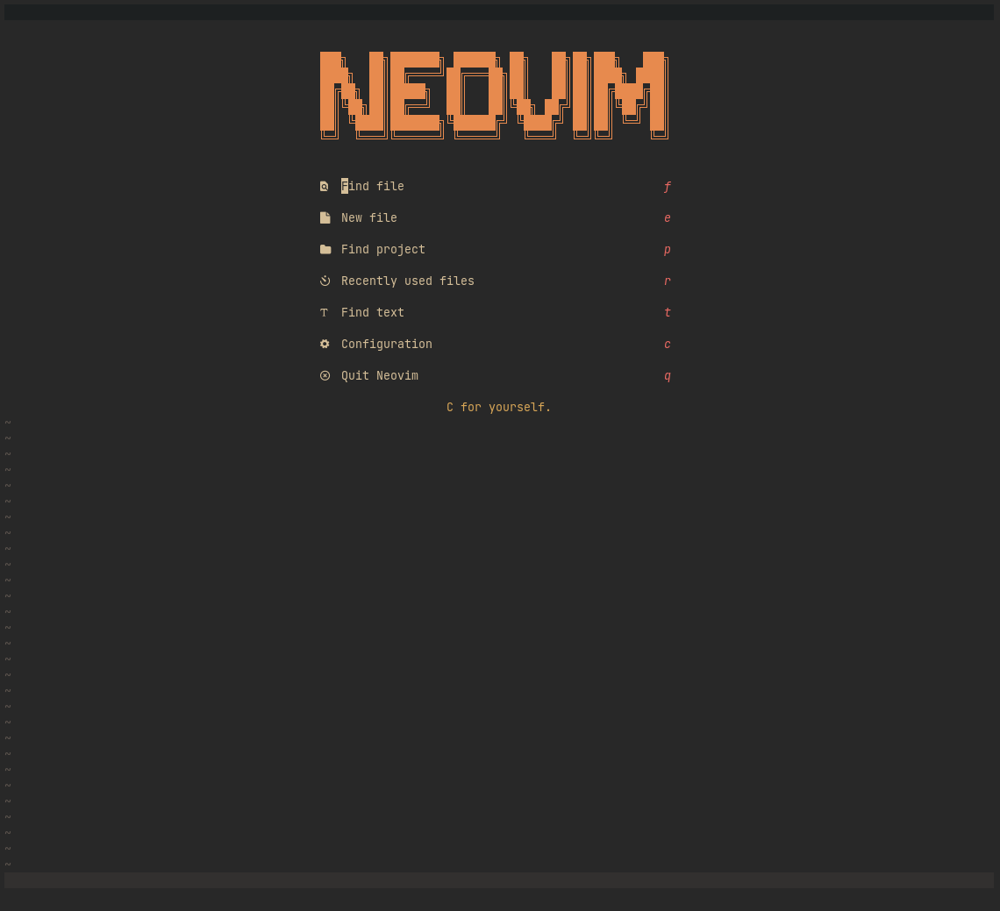
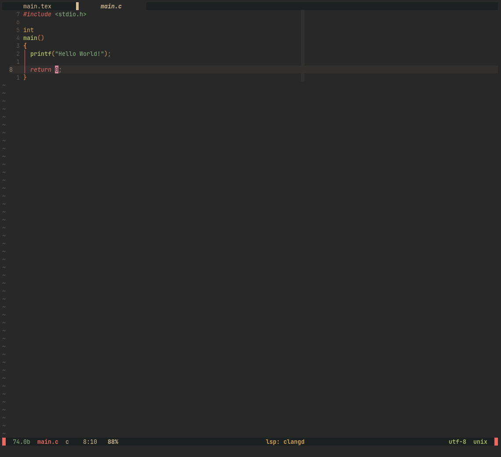

# neovim
Personal neovim 100% lua configuration with LSP support, autocompletion,
autoformatting, improved syntax highlight and snippets.

## Plugins
Below the list of plugins used in this config:
- [packer](https://github.com/wbthomason/packer.nvim) (plugin manager)
- [popup](https://github.com/nvim-lua/popup.nvim)
- [plenary](https://github.com/nvim-lua/plenary.nvim)
- [gruvbox-material](https://github.com/sainnhe/gruvbox-material) (coloscheme)
- [nvim-cmp](https://github.com/hrsh7th/nvim-cmp) (completion engine)
- [cmp-buffer](https://github.com/hrsh7th/cmp-buffer)
- [cmp-path](https://github.com/hrsh7th/cmp-path)
- [cmp-cmdline](https://github.com/hrsh7th/cmp-cmdline)
- [cmp-nvim-lsp](https://github.com/hrsh7th/cmp-nvim-lsp)
- [cmp-nvim-lua](https://github.com/hrsh7th/cmp-nvim-lua)
- [cmp-calc](https://github.com/hrsh7th/cmp-calc)
- [cmp-luasnip](https://github.com/saadparwaiz1/cmp_luasnip)
- [luasnip](https://github.com/L3MON4D3/LuaSnip) (snippet engine)
- [nvim-lspconfig](https://github.com/neovim/nvim-lspconfig)
- [nvim-lsp-installer](https://github.com/williamboman/nvim-lsp-installer)
- [null-ls.nvim](https://github.com/jose-elias-alvarez/null-ls.nvim)
- [telescope.nvim](https://github.com/nvim-telescope/telescope.nvim) (fuzzy finder)
- [telescope-ui-select.nvim](https://github.com/nvim-telescope/telescope-ui-select.nvim)
- [nvim-treesitter](https://github.com/nvim-treesitter/nvim-treesitter)
- [playground](https://github.com/nvim-treesitter/playground)
- [nvim-ts-rainbow](https://github.com/p00f/nvim-ts-rainbow)
- [lualine.nvim](https://github.com/nvim-lualine/lualine.nvim) (main bottom statusline)
- [bufferline](https://github.com/akinsho/bufferline.nvim) (top buffers status line)
- [vim-bbye](https://github.com/moll/vim-bbye)
- [Comment.nvim](https://github.com/numToStr/Comment.nvim) (commenter)
- [nvim-ts-context-commentstring](https://github.com/JoosepAlviste/nvim-ts-context-commentstring)
- [gitsigns.nvim](https://github.com/lewis6991/gitsigns.nvim) (git information)
- [nvim-tree.lua](https://github.com/kyazdani42/nvim-tree.lua) (file tree)
- [toggleterm.nvim](https://github.com/akinsho/toggleterm.nvim) (terminal buffers helper)
- [nvim-colorizer.lua](https://github.com/norcalli/nvim-colorizer.lua) (show colors as text background)
- [crates.nvim](https://github.com/Saecki/crates.nvim) ([crates.io](https://crates.io) interface for `Cargo.toml` files)
- [alpha-nvim](https://github.com/goolord/alpha-nvim) (dashboard)

## Screenshots
- Dashboard:

- `C` buffer example:

